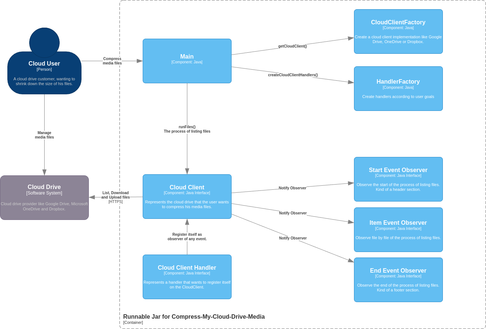

# Compress-My-Cloud-Drive-Media

The goal of this software is to manage the size of any cloud drive.

But initially, the goal was to compress my video files from Google Drive to reduce storage costs, 
and as things get working, images and PDF files also was included.

The application architecture is based on a mix of chain of responsibility [(1)](https://sourcemaking.com/design_patterns/chain_of_responsibility) [(2)](https://refactoring.guru/design-patterns/chain-of-responsibility) 
and Observer [(3)](https://sourcemaking.com/design_patterns/observer) [(4)](https://refactoring.guru/design-patterns/observer). It's a mix because initially this could be made just with 
chain of responsibility handlers, but with handlers also been observers enables paginated query 
of cloud client API. Otherwise, it would be necessary to run all files first, and then compress 
them, diminishing the user experience.

This architecture enables the implementation of any compressor interacting with any cloud drive, 
by just implementing interfaces and registering observer-handlers in the factory [(5)](https://refactoring.guru/design-patterns/factory-method) [(6)](https://sourcemaking.com/design_patterns/abstract_factory).

Using the [C4 Model](https://c4model.com/) diagram notation, you can see the System Context Diagram 
and the Component Diagram below. The Container Diagram is unnecessary due to the current simplicity of
the application.

## System Context Diagram


## Component Diagram



## How to Use

### List Files

After downloading a release you can just list all your media files in the console like this:

```bash
java -jar cloud-drive-compressor-1.0.0-runner.jar --list --cloud-drive=google
```

This command will launch the OAuth flow for your Google account.
Once authorized, the program will list all your files, not just media files, 
because since the goal is to reduce the storage of your drive, you need to 
understand what your cloud drive storage is composed of, then, after being sure
that the problem is your media files, you could compress it.

### Export to CSV

Another command that yoy can run is the following:

```bash
java -jar cloud-drive-compressor-1.0.0-runner.jar --csv --cloud-drive=google
```

This command will create a CSV file containing some information about all your files that you
can group by type or folder, in order to understand where is the biggest files.

### Compressing Media Files

Finally, to compress your media files you can compress just Videos, just Photos or just PDFs 
or all of them, like the following command:

```bash
java -jar cloud-drive-compressor-1.0.0-runner.jar --download --download-folder=~/Downloads --video --image --pdf --cloud-drive=google
```
