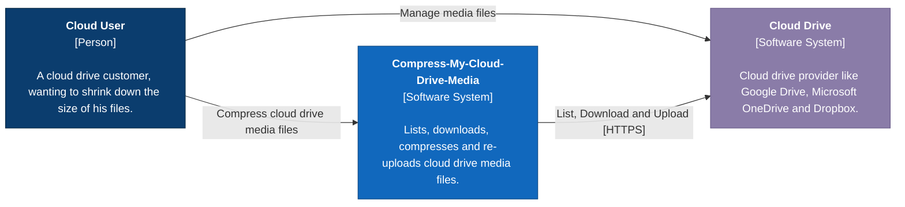
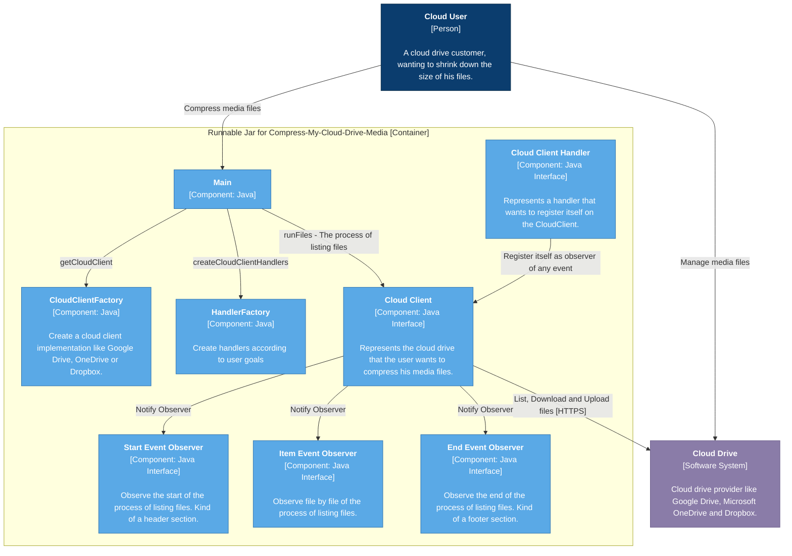

# Compress-My-Cloud-Drive-Media

The goal of this software is to manage the size of any cloud drive.

But initially, the goal was to compress my video files from Google Drive to reduce storage costs, 
and as things get working, images and PDF files also was included.

The application architecture is based on a mix of chain of responsibility [(1)](https://sourcemaking.com/design_patterns/chain_of_responsibility) [(2)](https://refactoring.guru/design-patterns/chain-of-responsibility) 
and Observer [(3)](https://sourcemaking.com/design_patterns/observer) [(4)](https://refactoring.guru/design-patterns/observer). It's a mix because initially this could be made just with 
chain of responsibility handlers, but with handlers also been observers enables paginated query 
of cloud client API. Otherwise, it would be necessary to run all files first, and then compress 
them, diminishing the user experience.

This architecture enables the implementation of any compressor interacting with any cloud drive, 
by just implementing interfaces and registering observer-handlers in the factory [(5)](https://refactoring.guru/design-patterns/factory-method) [(6)](https://sourcemaking.com/design_patterns/abstract_factory).

Using the [C4 Model](https://c4model.com/) diagram notation, you can see the System Context Diagram 
and the Component Diagram below. The Container Diagram is unnecessary due to the current simplicity of
the application.

## System Context Diagram


```mermaid
graph LR
    User["<b>Cloud User</b><br/>[Person]<br/><br/>A cloud drive customer, wanting to shrink down the size of his files."]
    System["<b>Compress-My-Cloud-Drive-Media</b><br/>[Software System]<br/><br/>Lists, downloads, compresses and re-uploads cloud drive media files."]
    CloudDrive["<b>Cloud Drive</b><br/>[Software System]<br/><br/>Cloud drive provider like Google Drive, Microsoft OneDrive and Dropbox."]

    User -->|Manage media files| CloudDrive
    User -->|Compress cloud drive media files| System
    System -->|"List, Download and Upload [HTTPS]"| CloudDrive

    classDef person fill:#0b3d6e,stroke:#062843,color:#fff
    classDef internal fill:#1168bd,stroke:#0b4884,color:#fff
    classDef external fill:#8a7ca8,stroke:#6b5d8a,color:#fff
    class User person
    class System internal
    class CloudDrive external
```

## Component Diagram


```mermaid
graph TD
    User["<b>Cloud User</b><br/>[Person]<br/><br/>A cloud drive customer, wanting to shrink down the size of his files."]
    CloudDrive["<b>Cloud Drive</b><br/>[Software System]<br/><br/>Cloud drive provider like Google Drive, Microsoft OneDrive and Dropbox."]

    subgraph Container["Runnable Jar for Compress-My-Cloud-Drive-Media [Container]"]
        Main["<b>Main</b><br/>[Component: Java]"]
        CloudClientFactory["<b>CloudClientFactory</b><br/>[Component: Java]<br/><br/>Create a cloud client implementation like Google Drive, OneDrive or Dropbox."]
        HandlerFactory["<b>HandlerFactory</b><br/>[Component: Java]<br/><br/>Create handlers according to user goals"]
        CloudClient["<b>Cloud Client</b><br/>[Component: Java Interface]<br/><br/>Represents the cloud drive that the user wants to compress his media files."]
        CloudClientHandler["<b>Cloud Client Handler</b><br/>[Component: Java Interface]<br/><br/>Represents a handler that wants to register itself on the CloudClient."]
        StartObserver["<b>Start Event Observer</b><br/>[Component: Java Interface]<br/><br/>Observe the start of the process of listing files. Kind of a header section."]
        ItemObserver["<b>Item Event Observer</b><br/>[Component: Java Interface]<br/><br/>Observe file by file of the process of listing files."]
        EndObserver["<b>End Event Observer</b><br/>[Component: Java Interface]<br/><br/>Observe the end of the process of listing files. Kind of a footer section."]
    end

    User -->|Compress media files| Main
    User -->|Manage media files| CloudDrive

    Main -->|getCloudClient| CloudClientFactory
    Main -->|createCloudClientHandlers| HandlerFactory
    Main -->|"runFiles - The process of listing files"| CloudClient

    CloudClient -->|"List, Download and Upload files [HTTPS]"| CloudDrive
    CloudClient -->|Notify Observer| StartObserver
    CloudClient -->|Notify Observer| ItemObserver
    CloudClient -->|Notify Observer| EndObserver

    CloudClientHandler -->|Register itself as observer of any event| CloudClient

    classDef person fill:#0b3d6e,stroke:#062843,color:#fff
    classDef internal fill:#5aa9e6,stroke:#2c72b0,color:#fff
    classDef external fill:#8a7ca8,stroke:#6b5d8a,color:#fff
    class User person
    class CloudDrive external
    class Main,CloudClientFactory,HandlerFactory,CloudClient,CloudClientHandler,StartObserver,ItemObserver,EndObserver internal
```

## Prerequisites

There are two ways to run this project:

- **[Docker](#running-with-docker)** — if you don't have Java installed (or don't want to), the only requirement is Docker itself, everything else (JDK, Maven, ffmpeg,
  Ghostscript) is built into the image. Skip straight to the
  [Running with Docker](#running-with-docker) section below.
- **Native**, described in this section — build and run directly on your machine with a local
  JDK/Maven install. Requires the following to be installed and on your `PATH`:

  - **JDK 21**
  - **[ffmpeg](https://ffmpeg.org/)** — used to compress video (`--video`) and image (`--image`)
    files.
  - **[Ghostscript](https://www.ghostscript.com/)** (`gs`) — used to compress PDF files (`--pdf`).

  On Debian/Ubuntu, both can be installed with:

  ```bash
  sudo apt-get update && sudo apt-get install -y ffmpeg ghostscript
  ```

## Google Drive Setup

Before running the application with `--cloud-drive=google`, you need to create your own OAuth
client credentials in Google Cloud and make them available to the application. If this step is
skipped or misconfigured, the application fails at startup with `Fail to initialize Google Drive
Client`.

1. Go to the [Google Cloud Console](https://console.cloud.google.com/) and create a new project
   (or select an existing one).
2. Enable the **Google Drive API** for that project (APIs & Services > Library > Google Drive API
   > Enable).
3. Configure the **OAuth consent screen** (APIs & Services > OAuth consent screen). For personal
   use, "External" with your own Google account added as a test user is enough.
4. Create an **OAuth client ID** (APIs & Services > Credentials > Create Credentials > OAuth
   client ID), choosing **Desktop app** as the application type.
5. Download the generated JSON file and save it as `client_secret.json` in the following path:

   ```text
   ~/credentials/client_secret.json
   ```

   This path is fixed and not currently configurable.
6. Run any command with `--cloud-drive=google`. The application will open a browser window (it
   starts a local server on port `8888` for the OAuth redirect) so you can sign in and grant
   access. After you approve it, the resulting token is cached under a `tokens/` folder created
   next to where you run the jar, so future executions won't ask you to sign in again.
   * If you ever change the requested permissions/scopes, delete the `tokens/` folder to force a
     new authorization flow.
   * When running inside Docker there's no browser to open automatically — the container prints
     the authorization URL to the console instead. Copy it into a browser on your host machine; see
     [Running with Docker](#running-with-docker) below for the port/volume setup this requires.

## Running with Docker

This is the recommended path if you don't have Java, Maven, ffmpeg or Ghostscript installed — the
`Dockerfile` in this repo builds an image with all of them bundled, so Docker is the only thing you
need on your machine.

### 1. Install Docker

Install [Docker Desktop](https://www.docker.com/products/docker-desktop/) (Mac/Windows) or
[Docker Engine](https://docs.docker.com/engine/install/) (Linux), then confirm it works:

```bash
docker --version
```

### 2. Get the source and build the image

```bash
git clone https://github.com/higorrg/compress-my-cloud-drive-media.git
cd compress-my-cloud-drive-media
docker build -t compress-my-cloud-drive-media .
```

This runs a full Maven build inside a container (no local JDK/Maven needed) and produces a final
image that also has `ffmpeg` and `gs` installed. It only needs to be rebuilt when the source code
changes.

### 3. Set up Google Drive credentials

Follow the [Google Drive Setup](#google-drive-setup) steps above to create `client_secret.json` on
your **host** machine at `~/credentials/client_secret.json` — the container doesn't create Google
Cloud credentials for you, it just needs to read that file, which is mounted in below.

### 4. Create a local data folder

The application writes its OAuth token cache (`tokens/`), the CSV export, and any downloaded/
compressed media relative to its working directory. Create a folder on your host to persist all of
that across container runs:

```bash
mkdir -p ~/compress-my-cloud-drive-media-data
```

### 5. Run the container

Every command in [How to Use](#how-to-use) below works the same with Docker — just replace
`java -jar cloud-drive-compressor-1.0.0-runner.jar` with:

```bash
docker run --rm -it \
  -p 8888:8888 \
  -v ~/credentials/client_secret.json:/root/credentials/client_secret.json:ro \
  -v ~/compress-my-cloud-drive-media-data:/data \
  compress-my-cloud-drive-media
```

followed by the same flags (e.g. `--list --cloud-drive=google`). For example, listing files becomes:

```bash
docker run --rm -it \
  -p 8888:8888 \
  -v ~/credentials/client_secret.json:/root/credentials/client_secret.json:ro \
  -v ~/compress-my-cloud-drive-media-data:/data \
  compress-my-cloud-drive-media \
  --list --cloud-drive=google
```

What each flag does:

- `-p 8888:8888` — exposes the local OAuth redirect server so the sign-in flow (step 6 of Google
  Drive Setup) can complete from your host browser.
- `-v ~/credentials/client_secret.json:/root/credentials/client_secret.json:ro` — mounts your OAuth
  client secret read-only; the container runs as root, so its home directory is `/root`.
- `-v ~/compress-my-cloud-drive-media-data:/data` — mounts your data folder as the container's
  working directory, so `tokens/`, `google-drive-files.csv` and any downloaded files land there and
  survive after the container exits.

If you use `--download`, point `--download-folder` inside that mounted folder so the downloaded and
compressed files end up on your host too, e.g. `--download-folder=/data/downloads`.

## How to Use

### List Files

After downloading a release you can just list all your media files in the console like this:

```bash
java -jar cloud-drive-compressor-1.0.0-runner.jar --list --cloud-drive=google
```

This command will launch the OAuth flow for your Google account.
Once authorized, the program will list all your files, not just media files, 
because since the goal is to reduce the storage of your drive, you need to 
understand what your cloud drive storage is composed of, then, after being sure
that the problem is your media files, you could compress it.

### Export to CSV

Another command that yoy can run is the following:

```bash
java -jar cloud-drive-compressor-1.0.0-runner.jar --csv --cloud-drive=google
```

This command will create a CSV file containing some information about all your files that you
can group by type or folder, in order to understand where is the biggest files.

### Compressing Media Files

Finally, to compress your media files you can compress just Videos, just Photos or just PDFs 
or all of them, like the following command:

```bash
java -jar cloud-drive-compressor-1.0.0-runner.jar --download --download-folder=~/Downloads --video --image --pdf --cloud-drive=google
```

### Restoring Images Corrupted With a Video Mime-Type

Older versions of this tool had a bug where an image could end up with its content and
`mimeType` overwritten by an unrelated file (see the project history for details), leaving the
image's Drive entry named like an image (e.g. `photo.jpg`) but reporting `mimeType: video/mp4`.

If your Drive has files like that, you can try to recover the original content from Google
Drive's revision history:

```bash
# Dry-run: only reports which files have a restorable image revision, changes nothing.
java -jar cloud-drive-compressor-1.0.0-runner.jar --restore-corrupted-image-mimetype --cloud-drive=google

# Actually restores the earliest image/* revision found for each affected file.
java -jar cloud-drive-compressor-1.0.0-runner.jar --restore-corrupted-image-mimetype --apply-restore --cloud-drive=google
```

This only helps if Drive still has an `image/*` revision in that file's history — Drive keeps a
limited revision history (by default 30 days or the last 100 revisions), so very old corruption
may not be recoverable this way.
